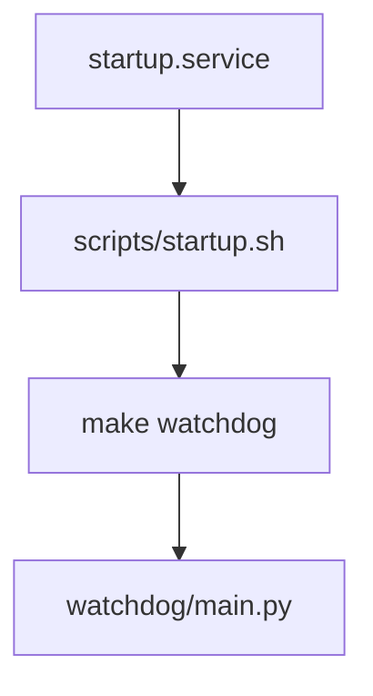

## Part 5: Autostart on target (systemd)

## Goal

Install and run the watchdog at boot via `startup.service`.

## Prereqs

- You are on the target machine (Ubuntu)
- You have the repo present at `/opt/blitz/B.L.I.T.Z/`
- You can run `sudo`

## How it starts at boot



## Steps: install

1. SSH into the target and go to the repo root:

```bash
cd /opt/blitz/B.L.I.T.Z
```

2. Run the install script (required):

```bash
bash scripts/install.sh --name <system_name>
```

## What `scripts/install.sh` changes

- Writes `system_data/name.txt` (used by the watchdog for identity)
- Installs system packages:
  - `protobuf-compiler`
  - `thrift-compiler`
- Runs:
  - `make initiate-project`
  - `make generate`
- Installs the unit file:
  - copies `scripts/startup.service` to `/etc/systemd/system/startup.service`
  - `systemctl enable startup`
  - `systemctl restart startup`

## Steps: verify

1. Check service status:

```bash
sudo systemctl status startup.service
```

2. Follow logs:

```bash
sudo journalctl -u startup.service -f
```

3. Verify the watchdog API from the target:

```bash
curl -sS http://localhost:5000/get/system/status
```

## Common failures

- **Service starts then exits immediately**: `scripts/startup.sh` exits if `system_data/name.txt` is missing.
- **Wrong repo location**: `startup.service` hard-codes `/opt/blitz/B.L.I.T.Z/scripts/startup.sh`.
- **Python deps missing**: rerun `make initiate-project` on the target and restart the service.
