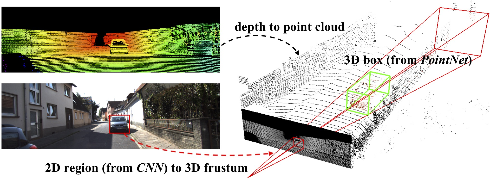

# Lidar Point Data Processor

## How this works

Very similar to frustum pointnet, except that we use a spherical map to store the point cloud data. And we need to use a camera to get the yaw and pitch of frustum. (maybe this literally is frustum pointnet not sure bc haavent read the paper for specifics)



## Lidar Note

This project uses unitree lidar L1. It can only produce ~21,600 points per second meaning that we might need to use multiple lidars to get a good frustum or increase the lifetime of each point (less accuracy).

## Package Manager

This project uses Conan - a c++/python lib generation library

## Function Note

This uses http server to send and receive data meaning that in python we can use the requests library to send and receive data.

### POST Request Format

```json
{
  "origin": {"x": double, "y": double, "z": double},
  "directions": [
    {"x": double, "y": double, "z": double}, 
    {"x": double, "y": double, "z": double}, 
    {"x": double, "y": double, "z": double}, 
    {"x": double, "y": double, "z": double}
  ]
}
```

Please note that the origin of the frustum and all the other points must be lidar relative coordinates. Meaning that you have to add the lidar position to the origin and the directions.

#### Example Request

An example request can be found in the [sample.json](sample.json) file.

### Response Format

```json
{
  "points": [
    {"x": double, "y": double, "z": double, "timestamp": double},
    ...
  ]
}
```
